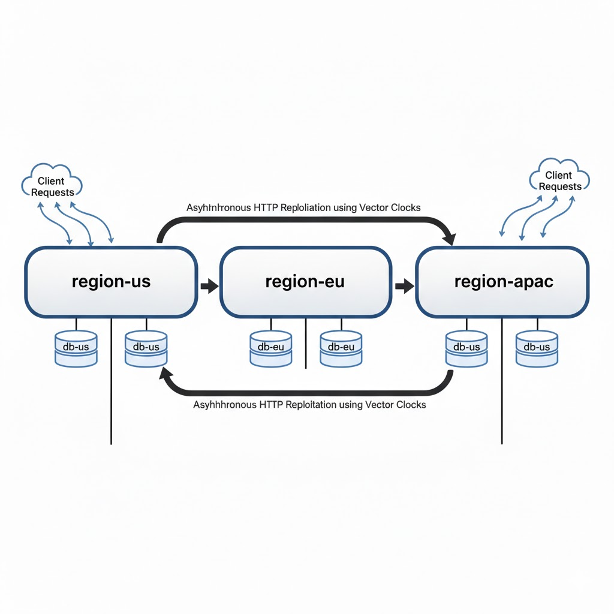

# Multi-Region Incident Management System with Vector Clocks

Author: Manasa Tadi
Tech Stack: Node.js, Express, PostgreSQL, Docker

---

## 1. Introduction

This project implements a distributed multi-region incident management backend that guarantees causal consistency using vector clocks.

The system simulates three independent geographic regions:

- region-us
- region-eu
- region-apac

Each region runs as an isolated service with its own PostgreSQL database. Updates are replicated asynchronously across regions while preserving causality and detecting concurrent conflicts.

This project demonstrates core distributed systems principles including:

- Logical clocks (vector clocks)
- Causal ordering
- Conflict detection and resolution
- Eventual consistency
- Idempotent replication
- Network partition handling
- Multi-service Docker orchestration

---

## 2. System Architecture

Each region consists of:

- Node.js + Express application
- Dedicated PostgreSQL database
- Background replication service

Replication occurs over HTTP between services inside the Docker network.

High-level architecture:

Client → Region Service → Local Database
Region Service ↔ Region Service (HTTP replication)

Each region operates independently and converges through asynchronous replication.

### Architecture
```
                   +-------------------+
                   |      Client       |
                   +-------------------+
                            |
        ----------------------------------------
         |                  |                   |
  +---------------+  +---------------+  +---------------+
  |   region-us   |  |   region-eu   |  |  region-apac  |
  +---------------+  +---------------+  +---------------+
         |                  |                   |
  +---------------+  +---------------+  +---------------+
  |     db-us     |  |     db-eu     |  |    db-apac    |
  +---------------+  +---------------+  +---------------+
```
Replication:
region-us  <--> region-eu
region-us  <--> region-apac
region-eu  <--> region-apac

### Architecture Diagram


---

## 3. Project Structure

```
multi-region-incident-system/
│
├── docker-compose.yml
├── Dockerfile
├── .env.example
├── simulate_partition.sh
├── README.md
│
├── package.json
└── src/
    ├── app.js
    ├── server.js
    │
    ├── config/
    │   └── config.js
    │
    ├── db/
    │   ├── db.js
    │   └── migrate.js
    │
    ├── models/
    │   └── incidentModel.js
    │
    ├── routes/
    │   ├── incidents.js
    │   └── internal.js
    │
    ├── services/
    │   ├── vectorClock.js
    │   └── replicationService.js
    │
    ├── docs/
    │   └── architecture.jpg
```

---

## 4. Database Schema

Each region maintains its own `incidents` table:

| Column           | Type         | Description                            |
| ---------------- | ------------ | -------------------------------------- |
| id               | UUID (PK)    | Unique incident identifier             |
| title            | VARCHAR(255) | Incident title                         |
| description      | TEXT         | Detailed description                   |
| status           | VARCHAR(50)  | OPEN, ACKNOWLEDGED, CRITICAL, RESOLVED |
| severity         | VARCHAR(50)  | LOW, MEDIUM, HIGH, CRITICAL            |
| assigned_team    | VARCHAR(100) | Responsible team                       |
| vector_clock     | JSONB        | Vector clock state                     |
| version_conflict | BOOLEAN      | Conflict flag                          |
| updated_at       | TIMESTAMP    | Last update time                       |

Vector clocks are stored as JSON:

```
{
  "us": 2,
  "eu": 1,
  "apac": 0
}
```

---

## 5. Vector Clock Implementation

### Supported Operations

- Increment: Local region increments its own counter.
- Compare: Determines relation between two clocks:
  - BEFORE
  - AFTER
  - EQUAL
  - CONCURRENT

- Merge: Element-wise maximum of two clocks.

### Conflict Rules

When receiving replicated data:

- AFTER → overwrite local state
- BEFORE → ignore (stale)
- EQUAL → ignore (duplicate)
- CONCURRENT → merge clocks and set `version_conflict = true`

---

## 6. API Documentation

### Public APIs

#### POST /incidents

Create a new incident.

Request:

```
{
  "title": "Database outage",
  "description": "Primary DB unreachable",
  "severity": "HIGH"
}
```

Response:

```
{
  "id": "uuid",
  "status": "OPEN",
  "vector_clock": { "us": 1, "eu": 0, "apac": 0 },
  "version_conflict": false
}
```

---

#### GET /incidents/{id}

Fetch incident by ID.

---

#### PUT /incidents/{id}

Update an incident.

Request must include `vector_clock`.

Request:

```
{
  "status": "ACKNOWLEDGED",
  "vector_clock": { "us": 1, "eu": 0, "apac": 0 }
}
```

Behavior:

- Rejects stale updates with HTTP 409.
- Increments local region counter on success.

---

#### POST /incidents/{id}/resolve

Resolve a conflict.

Request:

```
{
  "status": "RESOLVED",
  "assigned_team": "SRE-Team"
}
```

Behavior:

- Clears conflict flag
- Increments local vector clock

---

### Internal APIs

#### POST /internal/replicate

Handles inter-region replication.

#### POST /internal/disable-replication

Temporarily disables replication (used for partition simulation).

#### POST /internal/enable-replication

Re-enables replication.

---

## 7. Replication Strategy

Replication is:

- Asynchronous
- Periodic (every 5 seconds)
- Idempotent
- Based on vector clock comparison

Each region sends its incidents to the other two regions.

Conflict resolution is deterministic and based on vector clock partial ordering.

---

## 8. Network Partition Simulation

The script `simulate_partition.sh` demonstrates:

1. Incident creation in US
2. Replication disabled in US and EU
3. Concurrent updates in both regions
4. Replication re-enabled
5. Conflict detection verified

Run:

```
chmod +x simulate_partition.sh
./simulate_partition.sh
```

Expected result:

```
"version_conflict": true
```

---

## 9. Causal Chain Preservation

Example:

1. US creates incident → { us:1 }
2. EU updates → { us:1, eu:1 }
3. APAC updates → { us:1, eu:1, apac:1 }

The final vector clock reflects the full causal chain.

---

## 10. Running the System

Build and start all services:

```
docker-compose up --build
```

All services start with health checks.

Ports:

- US → localhost:3000
- EU → localhost:3001
- APAC → localhost:3002

---

## 11. Environment Variables

All required variables are documented in `.env.example`.

Each region configures:

- REGION
- Database credentials
- Service URLs

No secrets are hardcoded.

---

## 12. Distributed System Properties Achieved

- Causal consistency via vector clocks
- Conflict detection for concurrent updates
- Idempotent replication
- Eventual consistency
- Partition tolerance
- Deterministic reconciliation
- Fully containerized multi-service architecture

---

## 13. Conclusion

This project demonstrates the implementation of vector clocks in a multi-region distributed backend system. It showcases how causal relationships between events can be preserved without relying on physical clocks, ensuring correctness even in the presence of concurrent updates and simulated network partitions.